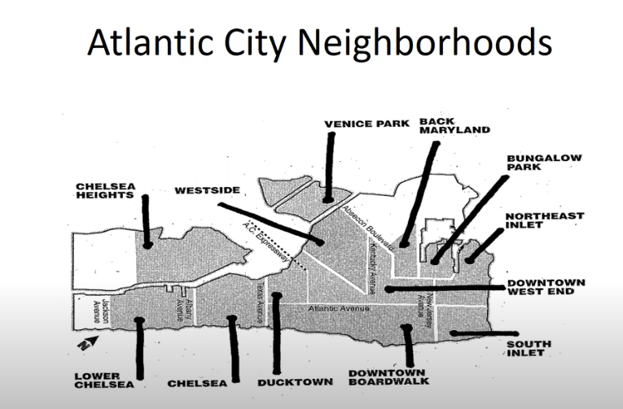

# New Jersey's Cultural Landscapes

**Mapping Atlantic City's cultural memory using the archive, data science, and interactive cartography**

Welcome to the documentation for this project, which explores the role of African American tourism, race, memory, and visual culture in Atlantic City through interactive cartography and archival research.

## Project Highlights

- Interactive maps visualizing historical African American tourism in Atlantic City  
- Integrated archival photographs, brochures, and documents  
- Data science methods including OCR, geospatial analysis, and fuzzy matching  
- Open source code available on [GitHub](https://github.com/cvanstey/data-in-the-archive_ACBT)  

## How to Navigate

Explore the sections above to dive into the data, methods, and maps. Start with the **About** page for background and then check out the **Maps** to see the interactive visualizations.

---

## Acknowledgments

This project is made possible by access to archival collections from Atlantic City Free Public Library, contributions from Heather Perez, and the power of open-source tools.
