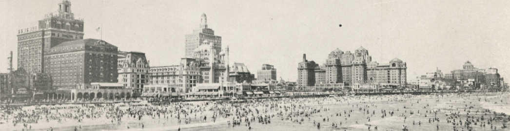

# 📖 INTRODUCTION

## Uncovering Atlantic City’s Black Cultural Memory through Data and Mapping

Atlantic City, New Jersey, was a vital hub of African American tourism, entrepreneurship, and social life during the era of segregation. Despite its significance, much of this history has been overlooked or forgotten—lost in ephemeral materials like mid-century tourism brochures, photographs, and city records that remain largely undigitized and inaccessible.

**New Jersey’s Cultural Landscapes: Mapping Atlantic City’s Cultural Memory** is an interdisciplinary effort to recover and reanimate these hidden stories. By digitizing archival materials and applying data science techniques alongside interactive cartography, this project aims to reveal the spatial and cultural dimensions of life in Atlantic City during the Jim Crow era.

---

## Project Goals

- **Recenter and preserve hidden histories** through the digitization and analysis of archival collections.
- **Apply data science tools** such as Optical Character Recognition (OCR), natural language processing, and geospatial analysis to clean, structure, and visualize complex historical data.
- **Build interactive maps and visualizations** that show how racialized space, entrepreneurship, and cultural memory intersect in Atlantic City.
- **Engage scholars, students, and the public** by providing open access to data, code, and interpretive resources.
- **To expand the sphere of knowledge** by connecting to other digital archives through links and associations.

---

## Methodological Foundations

This project sits at the crossroads of Digital Humanities, American Studies, and Archival Science. This workflow combines:

- High-resolution digitization and OCR of printed materials to extract machine-readable text.
- Data cleaning, parsing, and fuzzy matching to create structured datasets from inconsistent and complex layouts.
- Geographic Information Systems (GIS) for spatial analysis and mapping of businesses, social organizations, and cultural landmarks.
- Web-based interactive visualizations developed with Python and JavaScript to enable dynamic exploration of the data.

---

## Why Atlantic City?

> _“There are many that sit idly by and let nature take its course, but since 1929 we have tried to improve our rooming houses, hotels, restaurants, sports emporiums, and other facilities in an effort to keep pace with the natural advantages. Indeed, we feel it is the duty of all to keep pace with the times as much as possible. In fact, that should go for the Northside and Southside alike. We can then stay in a position to keep Atlantic City alive, and ‘The Playground of the World’ it is known to be throughout the world.”_  
> — C.J. Newsome, *Negro History Bulletin*, 1952

Atlantic City served as a vibrant space of Black social life, cultural expression, and economic resilience during a period of segregation and racial exclusion. Exploring these layered histories offers vital insight into the dynamics of racial capitalism, tourism, and memory in the mid-20th century.

---

## Why Focus on the Atlantic City Board of Trade Brochures?

> _“The American Teachers Assn., The N. M. A., The National Undertakers Assn., The National Federation of Colored Women’s Clubs, The Grand Lodge of Colored Elks, The Alpha Phi Alpha Fraternity, The Beauticians, Church Conferences, and several smaller groups most of whom came during the off season. The Elks met here in August of this year, the Undertakers and Postal Employees will meet here next year. They have been here two or more times before, in fact, it is estimated that since 1931 our visiting conventions have brought a minimum of $1,000,000.00 a year to this city.”_  
> — C.J. Newsome, *Negro History Bulletin*, 1952

These brochures are unique artifacts that document a thriving network of Black-owned businesses, social organizations, and cultural events. Despite their promotional origins, they serve as crucial vernacular records that reveal community agency, economic vitality, and social connections often absent from formal archives.

---

## Atlantic City Board of Trade Summary

<a href="ACBT_summary.html" target="_blank">📄 View the ACBT Summary Table</a>

---

### Citation

**GENERAL HISTORY OF THE ATLANTIC CITY BOARD OF TRADE, INC**  
Author(s): Clifford J. Newsome  
Source: *Negro History Bulletin*, NOVEMBER, 1952, Vol. 16, No. 2 (NOVEMBER, 1952), pp. 27–30  
Published by: Association for the Study of African American Life and History  
Stable URL: [https://www.jstor.org/stable/44214491](https://www.jstor.org/stable/44214491)  

> JSTOR is a not-for-profit service that helps scholars, researchers, and students discover, use, and build upon a wide range of content.

---

## Source Materials

- Atlantic City Board of Trade brochures (1930s–1940s), digitized from the Atlantic City Free Public Library collections.
- Related archival photographs, maps, and ephemera from regional institutions including Stockton University Special Collections.
- Oral histories and scholarly commentaries that contextualize and enrich the data.

---

## Learn More

- Detailed technical workflows can be found in the [Methods](methods.md) section.  
- Explore structured datasets in the [Data](data.md) section.  
- Interact with geospatial visualizations on the [Maps](maps.md) page.  
- Access the project’s full codebase and open data on [GitHub](https://github.com/cvanstey/data-in-the-archive_ACBT).

---

For questions or collaboration inquiries, please visit the [Contact](contact.md) page.

---

